  <!-- 1. Custom UI/UX Animated Header SVG -->
  

  <!-- 2. DenverCoder1 Typing SVG with your custom roles -->
  

 

  <!-- 3. Minimalist Black & Violet Social Badges -->
  
  
  

---

### 💜 About Me

* 🎓 **Education:** Pursuing a Bachelor of Science in Information Technology at Batangas State University (The National Engineering University), College of Informatics and Computing Sciences.
* 🎯 **Career Target:** Cybersecurity, Cloud Infrastructure, and AI Professional.
* 💻 **Currently Learning:** AWS Cloud Practitioner certification, advanced AI integrations, and secure cloud environments.
* 🚀 **Interests:** Leveraging Artificial Intelligence for automation, fortifying network security, and architecting scalable cloud solutions.
* 🤝 **Open To:** Open-source collaborations, freelance programming, and opportunities within the Cybersecurity and Cloud sectors.

---

### 🛠️ Tech Stack & Credentials

**☁️ Cloud & Cybersecurity** 

**🤖 AI & Data** 

**📡 Networking & Architecture** 

**💻 Web Development** 

---

### 📈 GitHub Stats

  <!-- Loading directly from your local profile folder generated by GitHub Actions -->
  
  
    

  <!-- Loading directly from your local profile folder generated by GitHub Actions -->
  

 

  <!-- Custom UI/UX Footer SVG with Quote -->
  

